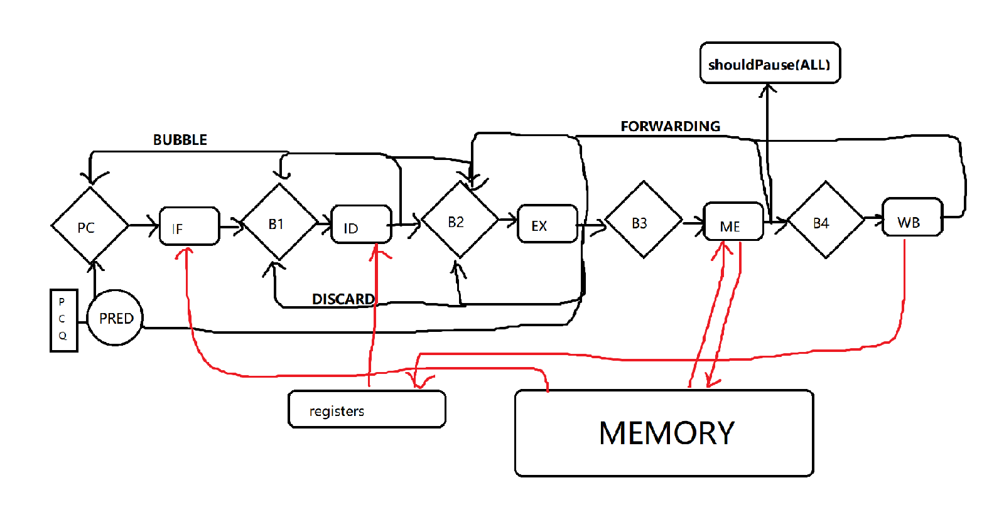

# RISC-V
RISC-V simulator by UnsignedLemon.
* 5-stage pipeline.
* supporting forwarding and random stage order.
* with a hybrid PC predictor.
## Implementation
### Register part:
* `memoryData` is the memory of the simulator.
* `R[0] ~ R[31]` are the valid registers.
* `B1 ~ B4` are the between-process buffers that store temporary results of function units.
* `PC` is the program counter. There's a complex predictor to determine jump & branch addresses.

**NOTICE: all the register parts are updated on the rise edge of clock. In WB process, it only changes their input value, while their output value is changed on the next cycle.**

### Function units part:
* `IF`: fetch data (data from PC) and do basic operations, such as acquiring `opcode` for prediction usage.
* `ID`: decode instruction (data from B1) , get `cmdType`,`rd/rs1/rs2` registers, try to load register data for B2.
* `EX`: do all the calculation (data from B2), such as compute add results or memory address. Also check PC prediction and determin whether instructions behind `shouldDiscard`
* `ME`: memory access (data from B3). Using 3 cycles to simulate time cost.
* `WB`: write back to registers (data from B4).

### Structure ###

