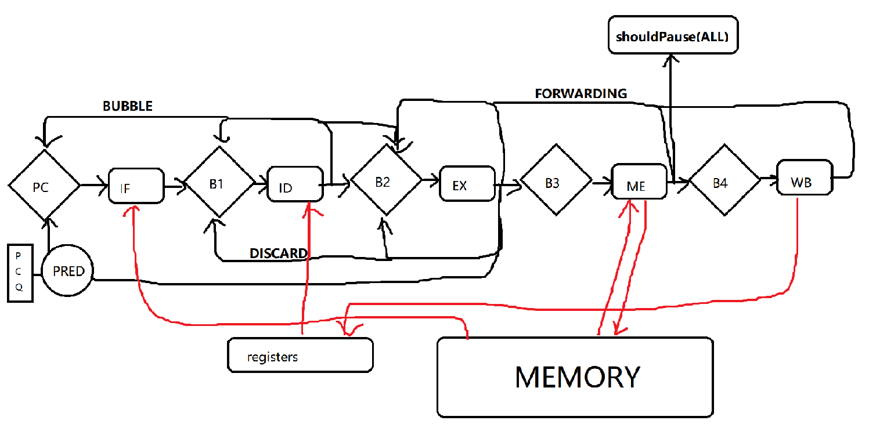

# RISC-V
RISC-V simulator by UnsignedLemon.
* 5-stage pipeline.
* supporting forwarding and random stage order.
* with a hybrid PC predictor.
## Implementation
### Register part:
* `memoryData` is the memory of the simulator.
* `R[0] ~ R[31]` are the valid registers.
* `B1 ~ B4` are the between-process buffers that store temporary results of function units.
* `PC` is the program counter. There's a complex predictor to determine jump & branch addresses.

**NOTICE: all the register parts are updated on the rise edge of clock. In WB process, it only changes their input value, while their output value is changed on the next cycle.**

### Function units part:
* `IF`: fetch data (data from PC) and do basic operations, such as acquiring `opcode` for prediction usage.
* `ID`: decode instruction (data from B1) , get `cmdType`,`rd/rs1/rs2` registers, try to load register data for B2.
* `EX`: do all the calculation (data from B2), such as compute add results or memory address. Also check PC prediction and determin whether instructions behind `shouldDiscard`
* `ME`: memory access (data from B3). Using 3 cycles to simulate time cost.
* `WB`: write back to registers (data from B4).

**Function units can be regarded as combinational circuits although they all have REG/MEM access. Their values can be updated right after REG/MEM update and actually have NO STORAGE UNITS in them (in my code, the storage buffer in each units represents the output ports to the next REAL buffers.)**

### Structure ###

## Code structure
* `resources.h`,`resources.cpp`,`enum.cpp`: global definations.
* `main.cpp`: major part of simulator, containing process of clock rise,`registers`update,`units`update.
* `reg.h`,`reg.cpp`: registers containing `REGISTER`,`PC`,`BUFFER`.
* `data.h`,`data.cpp`: memory.
* `units.h`, `units.cpp`: function units containing `IF/ID/EX/ME/WB`.
* `predictor.h`, `predictor.cpp`: hybrid predictor.

## Predictor Implementation
A **2-bit counter** *(I call it TBC)* is required, which stores a 2-bit counter for every branch PC.
There's an advanced version, **Local History Predictor** *(I call it LHP)*, which stores many different 2-bit counter for one branch PC in terms of their 'branch history', a 0/1 sequence of certain length representing the last few branches of this PC `taken/not_taken`.
Also there's another version, **Global History Predictor** *(GHP)*, where all the branch PC share a global sequence of `taken/not_taken`.

Here are the variables I used in the predictors above.
### All predictor ###
* `targetAddress[PCTableSize]`: if `taken`, jump to where.
### TBC ###
* `twoBitCounter[]`: 2-bit counter for every PC.
### LHP ###
* `branchHistoryTable[]`: the history sequence of every PC representing `taken/not_taken`.
* `PCTable[PCTableSize][historySize]:` the 2-bit counter for every PC of every history sequence.
### GHP ###
* `globalPattern`: the global history sequence of all branches.
* `PCTable[][]`: same as above. 

I take PCTableSize as (1<<8) and historySize as (1<<9). Thus 9 previous decisions are recorded. Also, in all testcases, the PC address are relatively small so there are almost no aliasing situations.

`GHP` and `LHP` need some cycles to train accuracy. So a `trainCycle[PCTableSize]` array is used to track the branch cycles of every PC. When the cycle is low, we take the `TBC` to do prediction, while there are enough cycles, we use `GHP` or `LHP` determined by another 2-bit counter `predictorChoice[]`.
